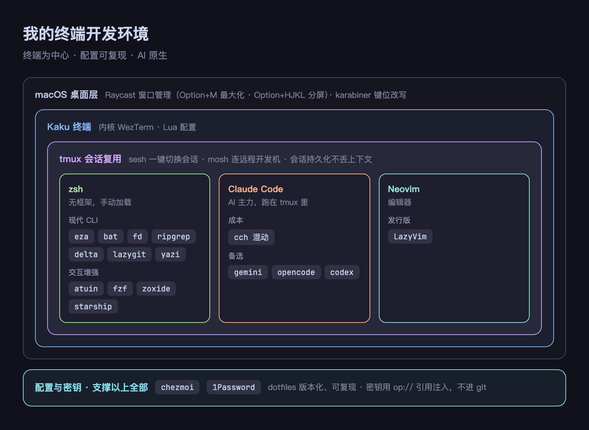
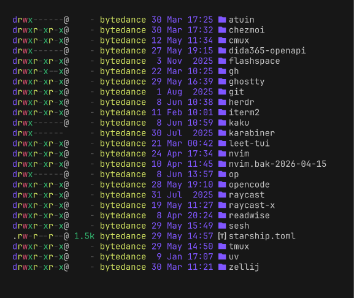
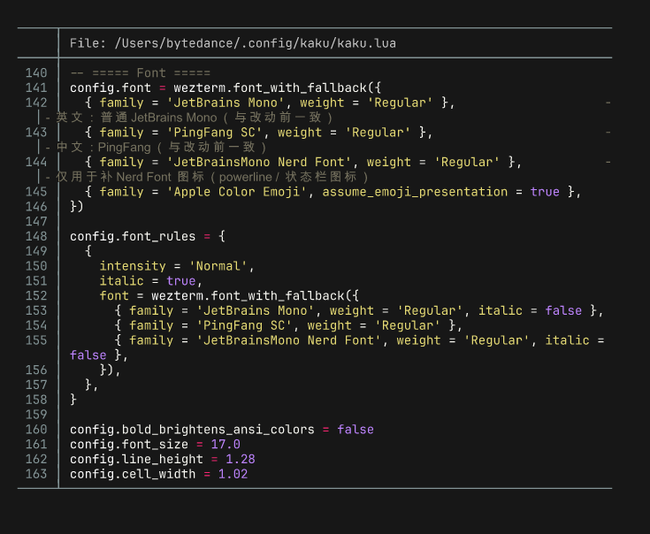

我日常的开发工作几乎都在终端里完成，IDE 已经很少打开了。这套环境是过去一段时间逐渐搭起来的，这篇文章记录一下它由哪些部分组成，以及每一处选择背后的考虑。一方面是分享给有类似需求的人，另一方面也方便我自己之后回顾。

整体结构如下图，下面逐层展开。

## 选择的标准

在介绍具体工具之前，先说一下我挑选它们时的几个标准，因为后面的大部分决定都是从这几条推导出来的：

- 启动和响应要快，不能有明显的等待；
- 高频操作尽量用键盘完成，但鼠标该好用的时候也要好用；
- 配置要能自己看懂、能版本化，换一台机器可以快速重建；
- 密钥不能以明文形式进入 git；
- AI 现在是我主要的生产力工具，既要用得顺手，也要控制成本。

## 终端：Kaku

终端用的是 Kaku，它的内核是 [WezTerm](https://wezfurlong.org/wezterm/)，使用 Lua 配置。选它主要是看中可编程性——标题栏、状态栏、分屏行为都可以用代码精确控制，而不是在图形界面里一项项设置。

我在配置里改了几个比较实用的键位：`Cmd+Enter` 和 `Shift+Enter` 发送换行但不执行（给 AI 输入多行 prompt 时很有用），`Cmd+R` 清屏并清掉回滚缓冲，以及把 Option 作为 Meta 键（否则 tmux 的快捷键没法正常用）。字体用 JetBrains Mono 作为主字体，中文回退到 PingFang，图标回退到 Nerd Font，这样英文、中文和图标都能正常显示。

我也装了 [Ghostty](https://ghostty.org/)，它更原生也更省电。最终还是用 Kaku，主要是因为可编程性，以及我个人更喜欢它的字体渲染。

## 会话管理：tmux + sesh + mosh

这三个工具组合在一起，解决的是同一个问题：不丢失工作上下文。

[tmux](https://github.com/tmux/tmux) 负责会话持久化，关掉终端或合上电脑之后，里面运行的进程依然在。[sesh](https://github.com/joshmedeski/sesh) 是会话切换器，我只需要记一个快捷键 `Option+s`，弹出的列表里会同时包含正在运行的会话、预设的项目模板，以及 zoxide 记录的常用目录，选一项就能进去。[mosh](https://mosh.org/) 用来连远程开发机，在弱网、漫游或者合盖唤醒的情况下都不会断开，体验比直接用 ssh 好不少。

这套组合的效果是，在不同项目之间切换的成本被压得很低：想去哪个项目，一个快捷键就够了，而且那个项目的环境一直在后台等着。

## Shell：zsh，但不用框架

shell 用的是 zsh，但我没有用 oh-my-zsh 这类框架。框架会拖慢启动，也会带进来很多我用不到的东西。我的做法是手动加载几个真正需要的：[atuin](https://atuin.sh/) 管理历史记录（支持搜索和同步），[fzf](https://github.com/junegunn/fzf) 做模糊查找，[zoxide](https://github.com/ajeetdsouza/zoxide) 用来快速跳目录，[starship](https://starship.rs/) 渲染提示符，再加上自动补全和语法高亮。

你可能会觉得不用框架会很麻烦，但实际上整个配置文件只有一百行出头，每一行的作用我都清楚，启动也很快。我觉得 shell 配置应该是透明可控的，而不是一个看不清内部的黑盒。

## 现代命令行工具

我把大部分传统命令替换成了用 Rust 重写的现代版本，并通过别名无缝接管：

| 传统命令 | 替代 | 主要改进 |
| --- | --- | --- |
| ls | [eza](https://github.com/eza-community/eza) | 彩色、显示 git 状态、支持树状视图 |
| cat | [bat](https://github.com/sharkdp/bat) | 语法高亮、行号 |
| find | [fd](https://github.com/sharkdp/fd) | 更快，默认遵循 .gitignore |
| grep | [ripgrep](https://github.com/BurntSushi/ripgrep) | 检索速度快很多 |
| git diff | [delta](https://github.com/dandavison/delta) | 并排、带语法高亮的差异显示 |
| git 操作 | [lazygit](https://github.com/jesseduffield/lazygit) | 可视化完成暂存、提交、分支等操作 |
| 文件管理 | [yazi](https://github.com/sxyazi/yazi) | 在终端里浏览文件，退出时把目录带回 shell |

单独看每个工具，提升似乎有限。但它们对应的都是每天要执行成百上千次的操作，每一次快一点、清楚一点，累积起来的差别并不小。下面两张分别是 eza 列目录和 bat 看文件的实际效果：

## 编辑器：Neovim + LazyVim

编辑器是 [Neovim](https://neovim.io/)，搭配 [LazyVim](https://www.lazyvim.org/) 发行版，开箱就带 LSP、补全、模糊查找和 git 集成，同时保留了进一步定制的空间。它和上面这套命令行工具属于同一个体系，不需要在终端和图形界面编辑器之间来回切换。

## AI：主力工具，同时控制成本

这一部分是我投入精力最多的地方。

主力是 [Claude Code](https://claude.com/claude-code)，运行在 tmux 里，全屏、推理档位拉满。在终端里，它就是一个能读写代码、执行命令的协作者。另外 [gemini](https://github.com/google-gemini/gemini-cli)、opencode、[codex](https://github.com/openai/codex) 也都装着，根据场景切换。

成本方面我做了一套混动：平时直接用主力模型保证质量；遇到消耗较大的任务，就切到一套让更便宜的模型去跑子任务的方案。这样在质量和成本之间留了一个可以主动控制的开关。

还有一个细节比较好用：我把 tmux 的窗口标题绑定到了 Claude 的状态上，它是在执行任务还是在等我输入，扫一眼标题就知道，不用逐个进入 pane 去看。

在我的使用习惯里，AI 更像终端里一个和其它进程同等的成员：它能调用我所有的命令行工具，我也可以像管理普通进程一样管理它，而不是把它当成编辑器边上的一个辅助插件。

## 桌面：Raycast 窗口管理 + karabiner

桌面这一层我没有上平铺式窗口管理器（试过，觉得太重）。窗口排布直接用 [Raycast](https://www.raycast.com/) 里配的快捷键：`Option+M` 最大化，`Option+H/J/K/L` 把当前窗口分屏到四个方向。够用，也省得常驻一个窗口管理器。[karabiner](https://karabiner-elements.pqrs.org/) 则用来改键位。它们的作用是把“键盘优先”从终端延伸到整个桌面，让手尽量不离开键盘。

## 配置与密钥：chezmoi + 1Password

这一层是整套环境能称为“系统”、而不是一堆零散配置文件的关键。

[chezmoi](https://www.chezmoi.io/) 管理所有 dotfiles，并版本化到一个私有仓库，换机器时可以快速重建。密钥则不进 git：配置文件里只保存 `op://...` 形式的引用，chezmoi 在应用配置时通过 [1Password](https://1password.com/) 实时注入，用 Touch ID 解锁。像 Claude Code 这种会在运行时自行改写 settings.json 的程序，对应的文件我没有纳入版本控制，以免产生持续的冲突。

我觉得这件事值得认真做。dotfiles 多少都会以某种形式公开，一旦明文密钥进了 git 历史，就等同于泄露。把“可复现”和“密钥不明文”这两件事一起解决，既方便换机，也不用担心某次提交时不小心带上了密钥。

## 一天的使用流程

开机后打开 Kaku，全屏运行 tmux。用 `Option+s` 选当天要做的项目，目录和之前打开的 Claude 都还在。在 pane 里执行 `claude`（需要控制成本时切到混动方案），用自然语言驱动它工作，窗口标题会显示它当前的状态。看差异用 lazygit 或 delta，浏览文件用 yazi，跳目录用 zoxide，检索历史用 atuin，整个过程基本不用鼠标。连开发机依靠 mosh，断网或合盖都不会掉线。改了任何配置，用 chezmoi 纳管并推送，而密钥始终只在 1Password 里。

## 如果想搭一套类似的

不必一步到位。按投入产出比，我建议的顺序是：先替换那批现代命令行工具，这一步成本最低、收益最直接；然后引入 tmux 和一个会话切换器，会明显改善上下文管理；再用 chezmoi 把配置管理起来，越早开始越划算；尽早把密钥迁移到密码管理器，不要等出了问题才做。有远程开发需求再考虑 mosh，想把桌面窗口操作也键盘化，用 Raycast 配几个快捷键就够，不必上重型窗口管理器。
